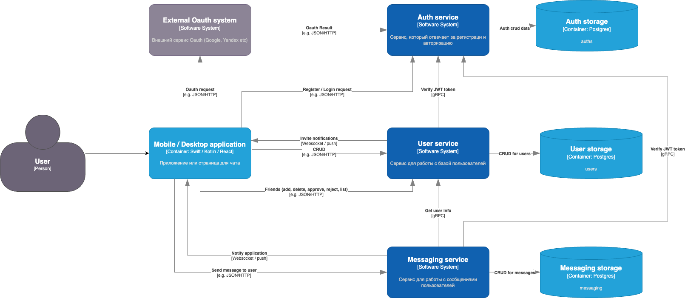

## Основное
Пользователь в приложении может зарегистрироваться или пройти аутентификацию для входа. После успешного прохода он получает JWT токен, который в дальнейшем будет использоваться во всех запросах к API. За это отвечает сервис auth-service.
Информация о всех пользователях, о связях пользователей находится в сервисе user-service.
Сообщения между пользователями хранятся в сервисе message-service.

### Auth-service
1. Метод для регистрация пользователя по email + password. От пользователя ожидаем ввода этих полей
```
email
password
```
2. Вариант попроще, просто принимать email и password без проверки
    1. (*) После ввода email необходимо проверить почту. Сервис отправляет письмо на указанный email со ссылкой, по которой необходимо пройти, чтобы поддвердить email. 
3. Сервис передает данные пользователя в сервис user-service.
4. Если все хорошо прошло, то создается JWT токен, который сохраняется в БД auth-service.
5. Так же сервис делает запрос на создания пользователя в БД user-service.

Второй вариант регистрации - это Oauth , там получаем потдтвержденный email и его созраняем также в БД auth-service.

### User-service
1. Все запросы должены быть с JWT токеном. Каждый запрос мы проверяем, ходим в auth-service, чтобы проверить токен по gRPC.
2. Сервис имеет следующие методы:
    - создать пользователя на основании данных из auth-service
    - получение информации о пользователе по nickname
    - редактирование профиля (nickname (уканильный), инфо о себе, аватарка)
    - добавить пользователя в друзья
    - удалить пользователя из друзей
    - подтвердить или отклонить запрос на дружбу
    - просмотр списка своих друзей (подтвердивших и не подтвердивших еще)
3. Сервис уведомбляет пользователя, что ему добавили в друзья
4. Сервис имеет свою БД.

### Messaging-service
1. Все запросы должены быть с JWT токеном. Каждый запрос мы проверяем, ходим в auth-service, чтобы проверить токен по gRPC.
2. Сервис имеет следующие методы:
    - написать сообщение кому-то (приманиет от кого и кому и текст)
3. Сервис уведомляет пользователя, что ему пришло сообщение
4. Сервис имеет свою БД.

## DataBase
В качестве БД везде используем релиационную БД PostgreSQL. Потому что нам надо хранить струторизированный формат данных и необходима поддержка транзакций. Postgres для этого отлично подходит и у нас в команде ее все знают.

## Events
Вариант, который реализуем: это джобы, которые будет крутится в каждом сервисе и проверять наличие данных в БД.

Вариант со (*) - это использовать брокер сообщений, например Kafka, чтобы как только приходит событие, то пушить в очередь и затем из этой очереди вытаскивать и уже делать тоже самое.